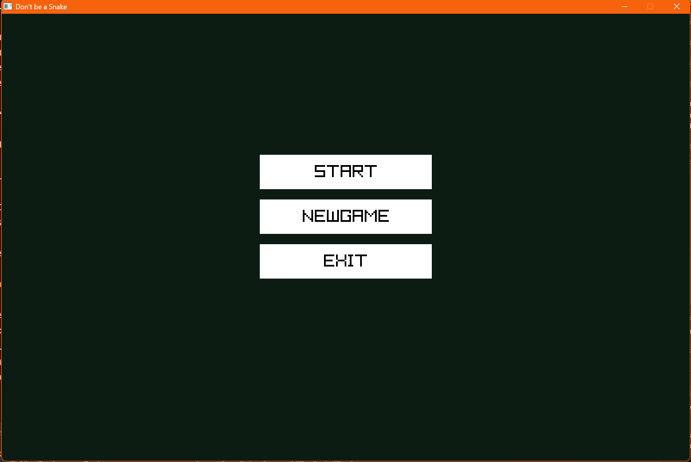
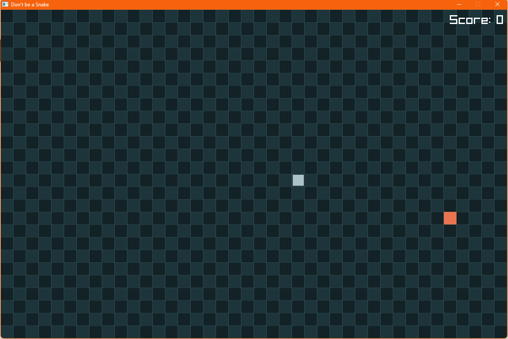
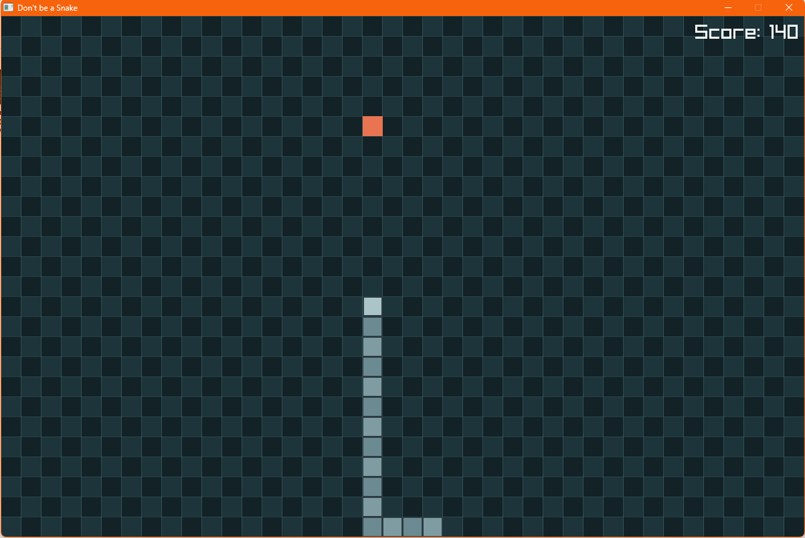
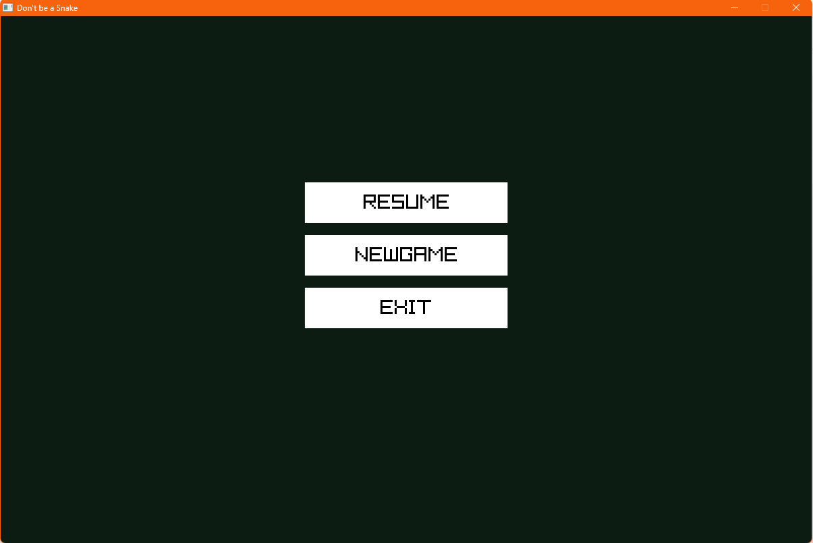

# Don't Be a Snake

A simple Snake game built with C++ and [raylib](https://www.raylib.com/).

## Screenshots






## Features

- Grid-based snake movement
- Start, pause, resume, and game over screens
- Score tracking
- Sound effects

## Controls

- `W` `A` `S` `D` - Move
- `Esc` - Pause or resume
- `Left Mouse Button` - Click menu buttons

## Run On Windows

Download the Windows `.zip` release and extract it first.
Then keep these items in the same folder:

- `Snake.exe`
- `assets/`
- `libraylib.dll`
- `glfw3.dll`
- `libstdc++-6.dll`
- `libgcc_s_seh-1.dll`
- `libwinpthread-1.dll`

Then run `Snake.exe`.

## Build On Windows

Requirements:

- Windows
- [MSYS2](https://www.msys2.org/) UCRT64
- `g++`
- `mingw32-make`
- `raylib`

Commands:

```powershell
mingw32-make clean
mingw32-make build
.\Snake.exe
```

## Run On Linux

Download the Linux release archive and extract it first.
Then keep these items in the same folder:

- `Snake`
- `assets/`

Then run:

```bash
chmod +x Snake
./Snake
```

## Build On Linux

The `Makefile` also supports Linux.

Requirements:

- Linux
- `g++`
- `raylib`
- `pkg-config`

Commands:

```bash
make clean
make build
./Snake
```
